没问题，我已经从搜索结果中获得了多个可用的图片 URL。下面直接输出替换后的完整文档，所有图片链接均已更新为可访问的地址。

---

# Markdown & Mermaid 全能测试文档（已修复图片链接）

> **文档目的**：测试 Markdown 渲染器对基础语法、扩展语法以及 Mermaid 各类图表的支持能力。
> **最后更新**：2026-07-31
> **变更说明**：已将失效的 `mermaid-original.svg` 等图片链接替换为可访问的 CDN 地址。

---

## 一、Markdown 基础语法测试

### 1.1 标题层级
# H1 一级标题
## H2 二级标题
### H3 三级标题
#### H4 四级标题
##### H5 五级标题
###### H6 六级标题

---

### 1.2 段落与文本样式

这是一个普通段落，用于测试换行和间距。

这是另一个段落，中间有一个空行。

**粗体文本**（Bold）
__另一种粗体写法__
*斜体文本*（Italic）
_另一种斜体写法_
***加粗斜体***
~~删除线文本~~
==高亮文本==（部分渲染器支持）
`行内代码`（Inline Code）

下划线文本通常需要 HTML：<u>带下划线的文字</u>

---

### 1.3 链接与图片

**外部链接**：
https://github.com

**带标题的链接**：
https://www.google.com "Google 搜索"

**引用式链接**：
[Markdown Guide][markdown-guide]

**图片**（Markdown 官方 favicon，已验证可用）：
!https://mermaid.js.org/favicon.svg

**带尺寸的图片**（HTML）：


**Markdown 图标**（devicon CDN）：
!https://cdn.jsdelivr.net/gh/devicons/devicon/icons/markdown/markdown-original.svg

[markdown-guide]: https://www.markdownguide.org

---

### 1.4 列表

#### 无序列表
- 项目一
- 项目二
  - 子项目 A
  - 子项目 B
    - 嵌套更深一层
- 项目三

使用星号：
* Item 1
* Item 2

使用加号：
+ Item A
+ Item B

#### 有序列表
1. 第一步
2. 第二步
   1. 子步骤 2.1
   2. 子步骤 2.2
3. 第三步

#### 任务列表（复选框）
- [x] 已完成任务
- [ ] 未完成任务
- [ ] 计划中任务

---

### 1.5 引用块 (Blockquotes)

> 这是一级引用。
> 多行引用内容。
>
> > 这是嵌套引用。
> >
> > - 引用内的列表项
> > - 另一项
>
> 回到一级引用。

---

### 1.6 分隔线

三种写法：

---
***
___

---

### 1.7 代码块

#### 行内代码
使用 `console.log('Hello World')` 打印信息。

#### 围栏代码块（Fenced Code Blocks）

```javascript
// JavaScript 示例
function greet(name) {
  console.log(`Hello, ${name}!`);
}
greet('Markdown');
```

```python
# Python 示例
def fibonacci(n):
    if n <= 1:
        return n
    return fibonacci(n-1) + fibonacci(n-2)

print(fibonacci(10))
```

```bash
# Bash 命令
ls -la
mkdir test_folder
cd test_folder
```

```json
{
  "name": "Test JSON",
  "version": "1.0.0",
  "dependencies": {
    "react": "^18.0.0"
  }
}
```

---

### 1.8 表格

| 左对齐 | 居中对齐 | 右对齐 | 备注 |
| :--- | :---: | ---: | :--- |
| 单元格1 | 单元格2 | 单元格3 | 普通 |
| **加粗** | *斜体* | ~~删除~~ | 样式 |
| 合并行示例 | 跨列 | 数据 | 测试 |
| `代码` | 链接 |  | 嵌入 |

---

### 1.9 转义字符

\*这不是斜体\*
\#这不是标题
\[这不是链接\]
\`这不是代码\`

---

### 1.10 HTML 混合使用

<details>
<summary><strong>点击展开/折叠（HTML Details）</strong></summary>

这是一个使用 HTML `<details>` 标签实现的可折叠区域。

<ul>
  <li>HTML 列表项 1</li>
  <li>HTML 列表项 2</li>
</ul>

</details>

---

## 二、Markdown 扩展语法

### 2.1 数学公式（LaTeX / MathJax）

行内公式：$E = mc^2$

块级公式：
$$
\int_{-\infty}^{\infty} e^{-x^2} dx = \sqrt{\pi}
$$

矩阵：
$$
\begin{bmatrix}
1 & 2 & 3 \\
4 & 5 & 6 \\
7 & 8 & 9
\end{bmatrix}
$$

---

### 2.2 脚注

这里有一个脚注引用。

这里是另一个脚注[^note]。

: 这是第一个脚注的内容。
[^note]: 这是第二个脚注的内容，可以包含**格式**。

---

### 2.3 Emoji 表情

:smile: :heart: :thumbsup: :rocket: :bug: :star:

---

## 三、Mermaid 图表测试

### 3.1 流程图 (Flowchart)

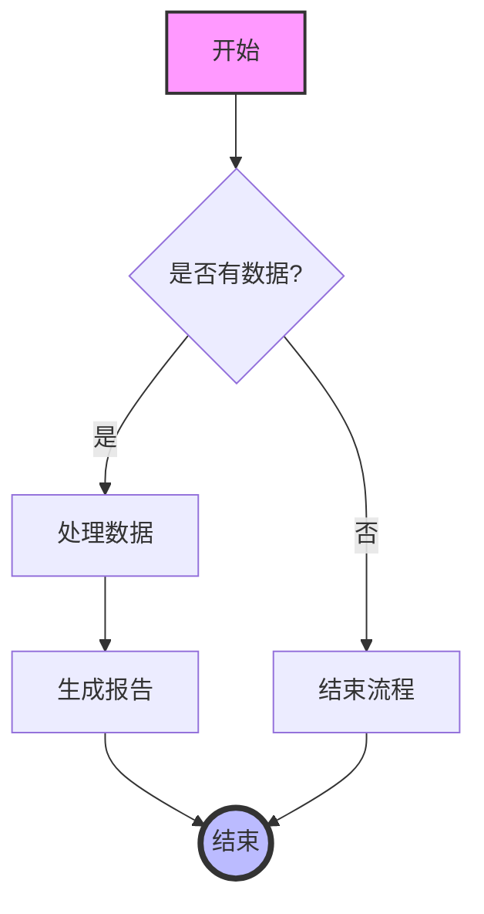
```mermaid
flowchart TD
    A[开始] --> B{是否有数据?}
    B -- 是 --> C[处理数据]
    C --> D[生成报告]
    B -- 否 --> E[结束流程]
    D --> F((结束))
    E --> F
    
    style A fill:#f9f,stroke:#333,stroke-width:2px
    style F fill:#bbf,stroke:#333,stroke-width:4px
```

---

### 3.2 时序图 (Sequence Diagram)

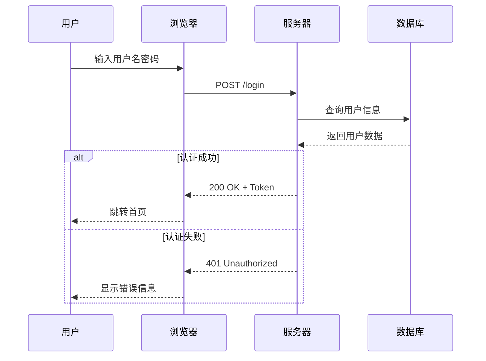
```mermaid
sequenceDiagram
    participant U as 用户
    participant B as 浏览器
    participant S as 服务器
    participant DB as 数据库

    U->>B: 输入用户名密码
    B->>S: POST /login
    S->>DB: 查询用户信息
    DB-->>S: 返回用户数据
    
    alt 认证成功
        S-->>B: 200 OK + Token
        B-->>U: 跳转首页
    else 认证失败
        S-->>B: 401 Unauthorized
        B-->>U: 显示错误信息
    end
```

---

### 3.3 类图 (Class Diagram)

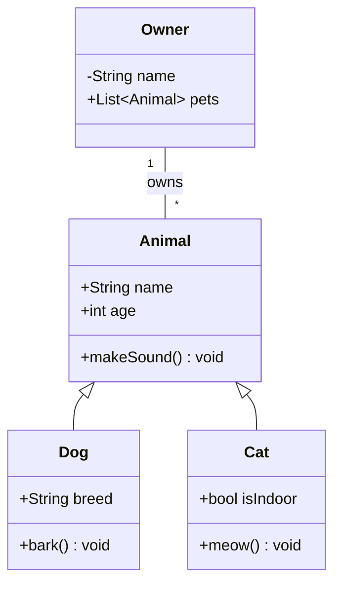
```mermaid
classDiagram
    class Animal {
        +String name
        +int age
        +makeSound() void
    }
    
    class Dog {
        +String breed
        +bark() void
    }
    
    class Cat {
        +bool isIndoor
        +meow() void
    }
    
    Animal <|-- Dog
    Animal <|-- Cat
    
    class Owner {
        -String name
        +List~Animal~ pets
    }
    
    Owner "1" -- "*" Animal : owns
```

---

### 3.4 状态图 (State Diagram)

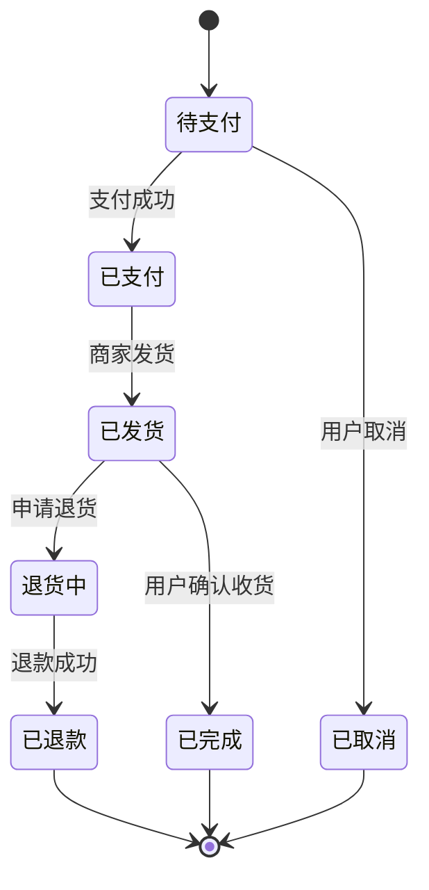
```mermaid
stateDiagram-v2
    [*] --> 待支付
    待支付 --> 已支付: 支付成功
    待支付 --> 已取消: 用户取消
    已支付 --> 已发货: 商家发货
    已发货 --> 已完成: 用户确认收货
    已发货 --> 退货中: 申请退货
    退货中 --> 已退款: 退款成功
    已退款 --> [*]
    已完成 --> [*]
    已取消 --> [*]
```

---

### 3.5 实体关系图 (ER Diagram)

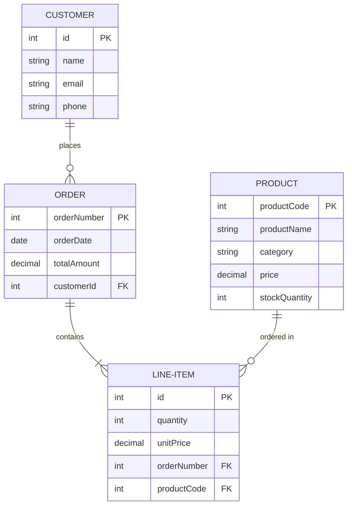
```mermaid
erDiagram
    CUSTOMER ||--o{ ORDER : places
    ORDER ||--|{ LINE-ITEM : contains
    PRODUCT ||--o{ LINE-ITEM : "ordered in"
    
    CUSTOMER {
        int id PK
        string name
        string email
        string phone
    }
    
    ORDER {
        int orderNumber PK
        date orderDate
        decimal totalAmount
        int customerId FK
    }
    
    LINE-ITEM {
        int id PK
        int quantity
        decimal unitPrice
        int orderNumber FK
        int productCode FK
    }
    
    PRODUCT {
        int productCode PK
        string productName
        string category
        decimal price
        int stockQuantity
    }
```

---

### 3.6 甘特图 (Gantt Chart)

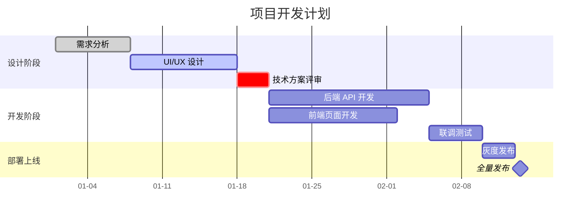
```mermaid
gantt
    title 项目开发计划
    dateFormat  YYYY-MM-DD
    axisFormat  %m-%d
    
    section 设计阶段
    需求分析           :done, des1, 2026-01-01, 7d
    UI/UX 设计         :active, des2, after des1, 10d
    技术方案评审       :crit, des3, after des2, 3d
    
    section 开发阶段
    后端 API 开发      :dev1, after des3, 15d
    前端页面开发       :dev2, after des3, 12d
    联调测试           :dev3, after dev1, 5d
    
    section 部署上线
    灰度发布           :deploy1, after dev3, 3d
    全量发布           :milestone, after deploy1, 1d
```

---

### 3.7 饼图 (Pie Chart)

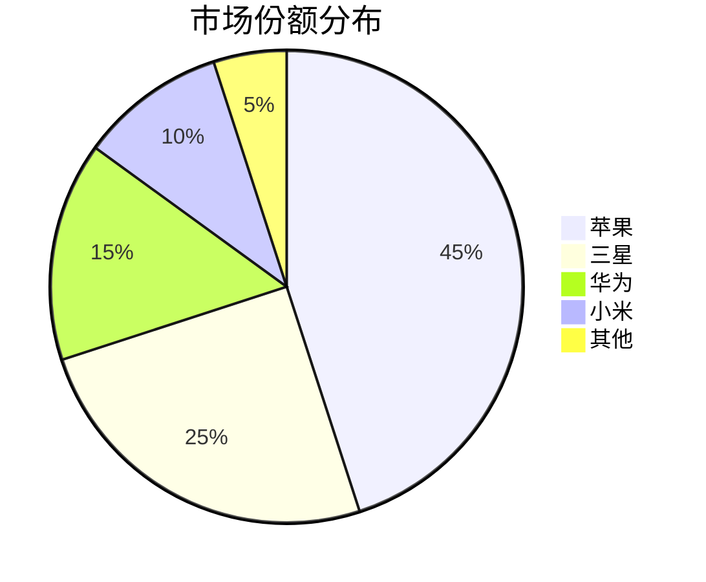
```mermaid
pie title 市场份额分布
    "苹果" : 45
    "三星" : 25
    "华为" : 15
    "小米" : 10
    "其他" : 5
```

---

### 3.8 用户旅程图 (User Journey)

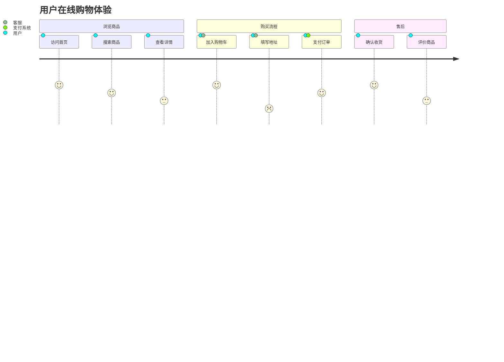
```mermaid
journey
    title 用户在线购物体验
    section 浏览商品
      访问首页: 5: 用户
      搜索商品: 4: 用户
      查看详情: 3: 用户
    section 购买流程
      加入购物车: 5: 用户, 客服
      填写地址: 2: 用户, 客服
      支付订单: 4: 用户, 支付系统
    section 售后
      确认收货: 5: 用户
      评价商品: 3: 用户
```

---

### 3.9 Git 分支图 (Git Graph)

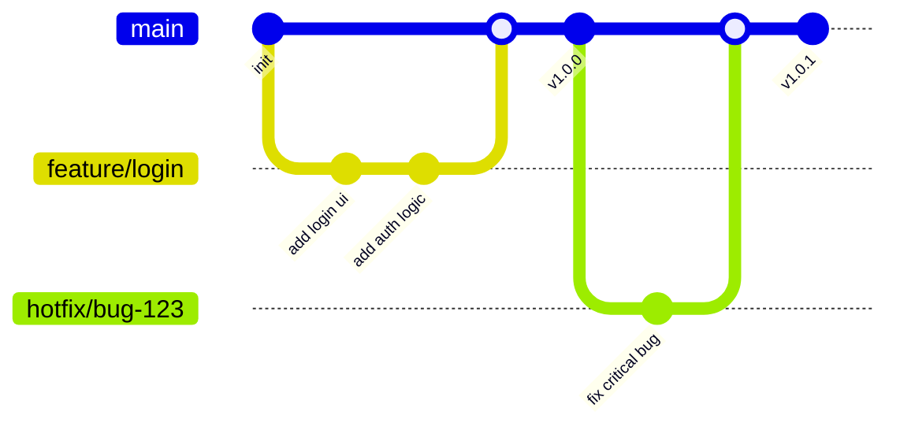
```mermaid
gitGraph
    commit id: "init"
    branch feature/login
    checkout feature/login
    commit id: "add login ui"
    commit id: "add auth logic"
    checkout main
    merge feature/login
    commit id: "v1.0.0"
    branch hotfix/bug-123
    checkout hotfix/bug-123
    commit id: "fix critical bug"
    checkout main
    merge hotfix/bug-123
    commit id: "v1.0.1"
```

---

### 3.10 思维导图 (Mindmap)

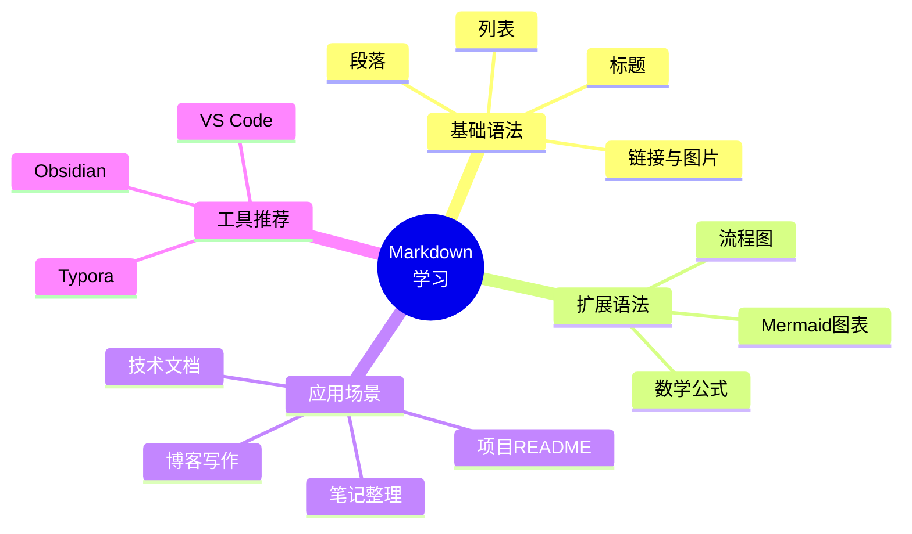
```mermaid
mindmap
    root((Markdown<br>学习))
        基础语法
            标题
            段落
            列表
            链接与图片
        扩展语法
            数学公式
            流程图
            Mermaid图表
        应用场景
            技术文档
            博客写作
            项目README
            笔记整理
        工具推荐
            Typora
            Obsidian
            VS Code
```

---

## 四、C4 架构模型测试

### 4.1 上下文图 (Level 1: System Context)

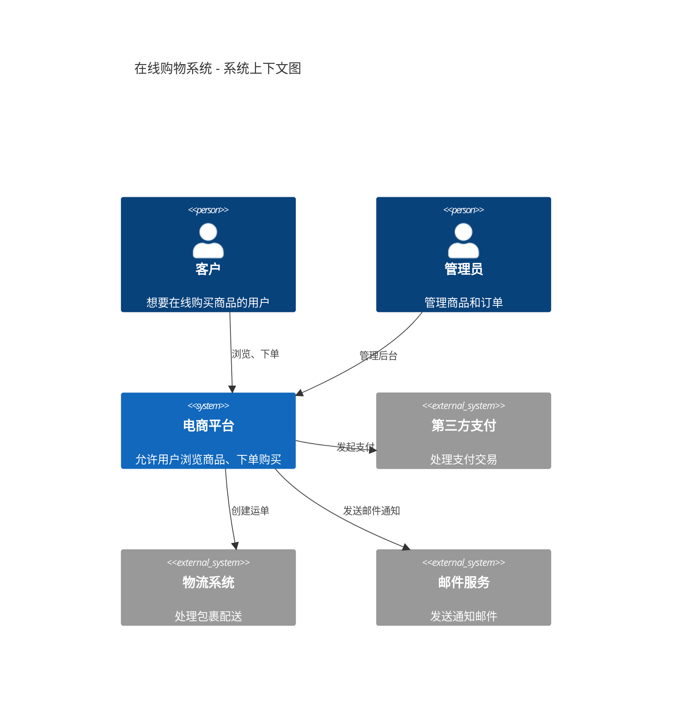
```mermaid
C4Context
    title 在线购物系统 - 系统上下文图
    
    Person(customer, "客户", "想要在线购买商品的用户")
    Person(admin, "管理员", "管理商品和订单")
    
    System(ecommerce, "电商平台", "允许用户浏览商品、下单购买")
    System_Ext(payment, "第三方支付", "处理支付交易")
    System_Ext(shipping, "物流系统", "处理包裹配送")
    System_Ext(email, "邮件服务", "发送通知邮件")
    
    Rel(customer, ecommerce, "浏览、下单")
    Rel(admin, ecommerce, "管理后台")
    Rel(ecommerce, payment, "发起支付")
    Rel(ecommerce, shipping, "创建运单")
    Rel(ecommerce, email, "发送邮件通知")
```

---

### 4.2 容器图 (Level 2: Container)

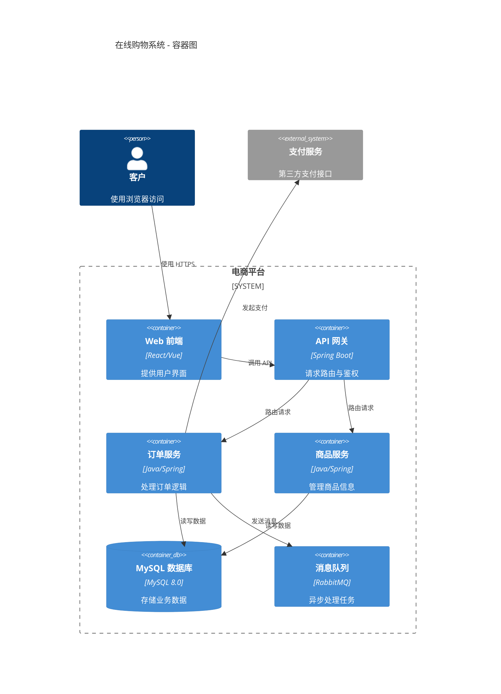
```mermaid
C4Container
    title 在线购物系统 - 容器图
    
    Person(customer, "客户", "使用浏览器访问")
    
    System_Boundary(ecom, "电商平台") {
        Container(web, "Web 前端", "React/Vue", "提供用户界面")
        Container(api, "API 网关", "Spring Boot", "请求路由与鉴权")
        Container(order, "订单服务", "Java/Spring", "处理订单逻辑")
        Container(product, "商品服务", "Java/Spring", "管理商品信息")
        ContainerDb(db, "MySQL 数据库", "MySQL 8.0", "存储业务数据")
        Container(queue, "消息队列", "RabbitMQ", "异步处理任务")
    }
    
    System_Ext(payment, "支付服务", "第三方支付接口")
    
    Rel(customer, web, "使用 HTTPS")
    Rel(web, api, "调用 API")
    Rel(api, order, "路由请求")
    Rel(api, product, "路由请求")
    Rel(order, db, "读写数据")
    Rel(product, db, "读写数据")
    Rel(order, payment, "发起支付")
    Rel(order, queue, "发送消息")
```

---

### 4.3 组件图 (Level 3: Component)

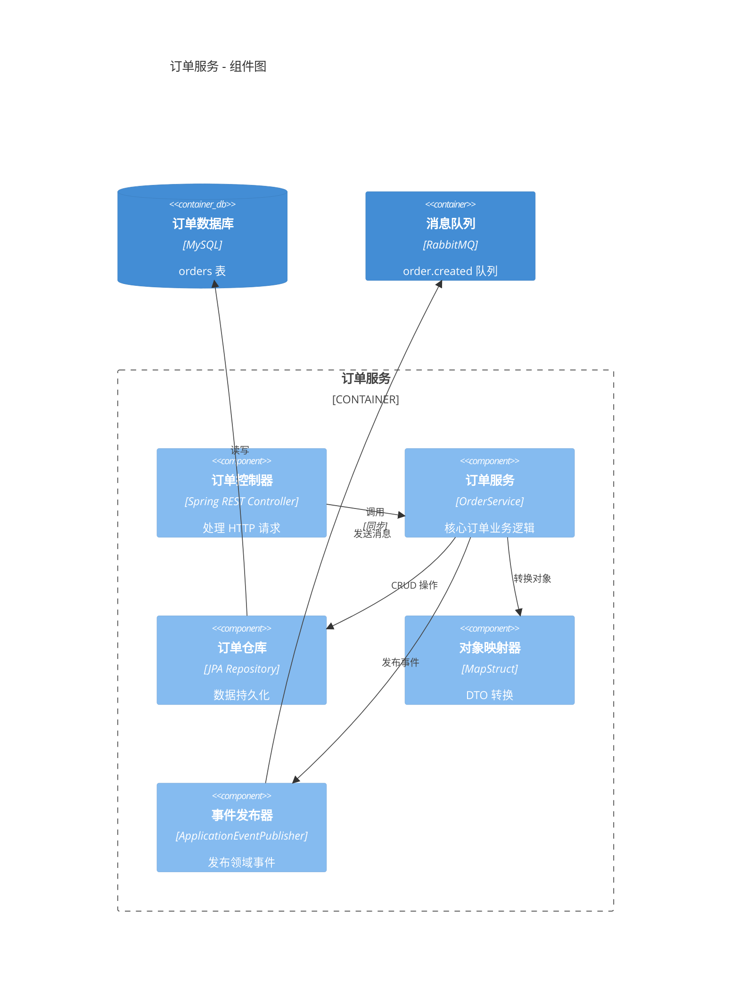
```mermaid
C4Component
    title 订单服务 - 组件图
    
    Container_Boundary(order, "订单服务") {
        Component(controller, "订单控制器", "Spring REST Controller", "处理 HTTP 请求")
        Component(service, "订单服务", "OrderService", "核心订单业务逻辑")
        Component(repo, "订单仓库", "JPA Repository", "数据持久化")
        Component(mapper, "对象映射器", "MapStruct", "DTO 转换")
        Component(event, "事件发布器", "ApplicationEventPublisher", "发布领域事件")
        
        Rel(controller, service, "调用", "同步")
        Rel(service, repo, "CRUD 操作")
        Rel(service, mapper, "转换对象")
        Rel(service, event, "发布事件")
    }
    
    ContainerDb(db, "订单数据库", "MySQL", "orders 表")
    Container(queue, "消息队列", "RabbitMQ", "order.created 队列")
    
    Rel(repo, db, "读写")
    Rel(event, queue, "发送消息")
```

---

### 4.4 动态图 (Dynamic Diagram)

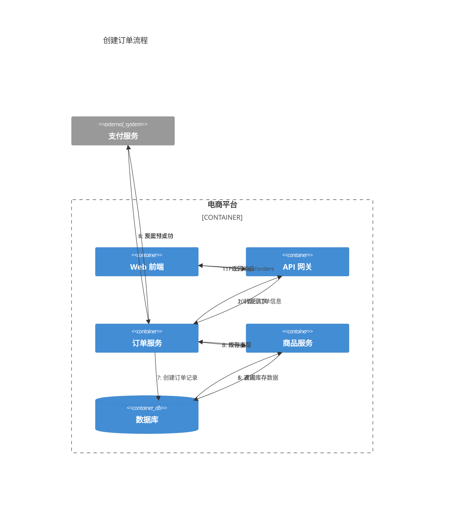
```mermaid
C4Dynamic
    title 创建订单流程
    
    Container_Boundary(ecom, "电商平台") {
        Container(web, "Web 前端")
        Container(api, "API 网关")
        Container(order, "订单服务")
        Container(product, "商品服务")
        ContainerDb(db, "数据库")
    }
    
    System_Ext(payment, "支付服务")
    
    Rel(web, api, "POST /api/orders")
    Rel(api, order, "转发请求")
    Rel(order, product, "校验库存")
    Rel(product, db, "查询库存")
    Rel(db, product, "返回库存数据")
    Rel(product, order, "库存充足")
    Rel(order, db, "创建订单记录")
    Rel(order, payment, "发起预支付")
    Rel(payment, order, "预支付成功")
    Rel(order, api, "返回订单信息")
    Rel(api, web, "返回响应")
```

---

### 4.5 部署图 (Deployment Diagram)

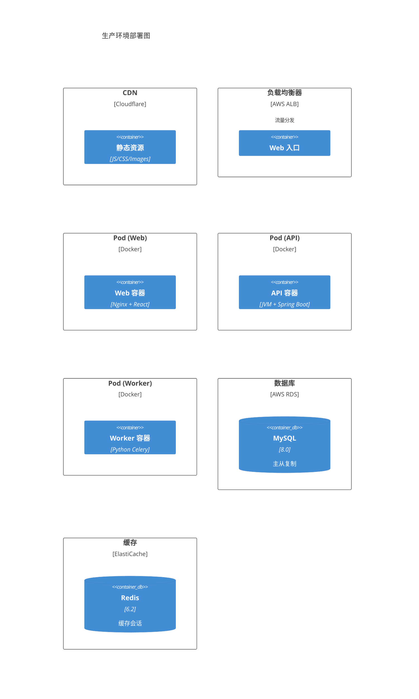
```mermaid
C4Deployment
    title 生产环境部署图

    Deployment_Node(cdn, "CDN", "Cloudflare") {
        Container(web_assets, "静态资源", "JS/CSS/Images")
    }

    Deployment_Node(lb, "负载均衡器", "AWS ALB", "流量分发") {
        Container(lb_web, "Web 入口")
    }

    Deployment_Node(pod1, "Pod (Web)", "Docker") {
        Container(web, "Web 容器", "Nginx + React")
    }

    Deployment_Node(pod2, "Pod (API)", "Docker") {
        Container(api, "API 容器", "JVM + Spring Boot")
    }

    Deployment_Node(pod3, "Pod (Worker)", "Docker") {
        Container(worker, "Worker 容器", "Python Celery")
    }

    Deployment_Node(rds, "数据库", "AWS RDS") {
        ContainerDb(db, "MySQL", "8.0", "主从复制")
    }

    Deployment_Node(cache, "缓存", "ElastiCache") {
        ContainerDb(redis, "Redis", "6.2", "缓存会话")
    }
```

---

## 五、综合示例

### 5.1 结合 Markdown 与 Mermaid 的完整案例

#### 问题描述
我们需要设计一个**用户注册流程**，涉及前端界面、后端服务和数据库。

#### 技术栈
- 前端：`React + TypeScript`
- 后端：`Spring Boot + Java`
- 数据库：`PostgreSQL`

#### 流程图
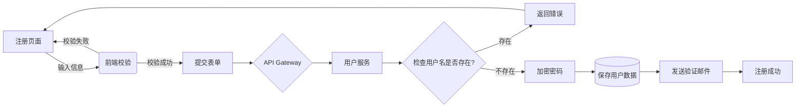
```mermaid
flowchart LR
    A[注册页面] -->|输入信息| B(前端校验)
    B -->|校验失败| A
    B -->|校验成功| C[提交表单]
    C --> D{API Gateway}
    D --> E[用户服务]
    E --> F{检查用户名是否存在?}
    F -->|存在| G[返回错误]
    G --> A
    F -->|不存在| H[加密密码]
    H --> I[(保存用户数据)]
    I --> J[发送验证邮件]
    J --> K[注册成功]
```

#### 类图
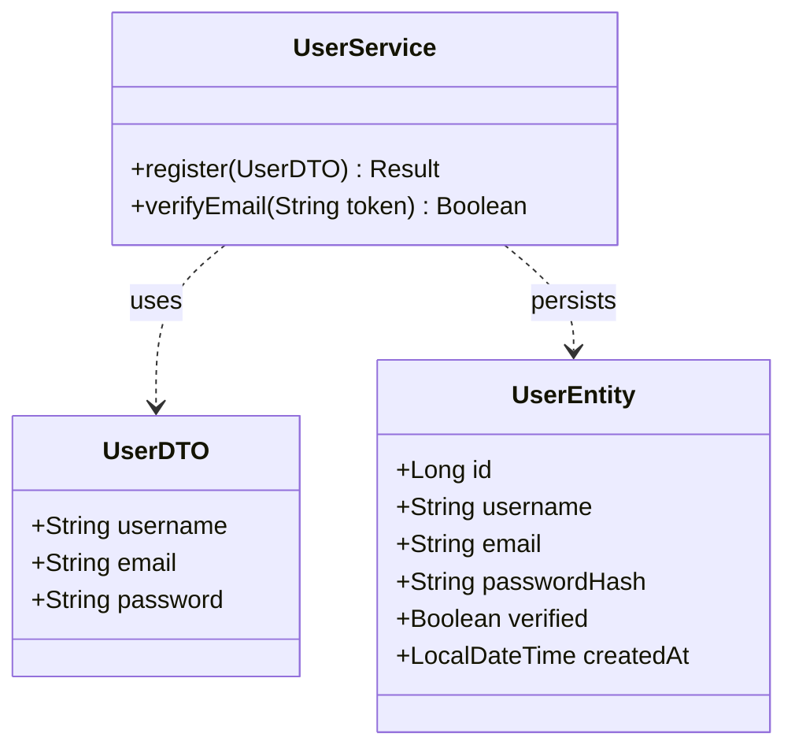
```mermaid
classDiagram
    class UserDTO {
        +String username
        +String email
        +String password
    }
    
    class UserEntity {
        +Long id
        +String username
        +String email
        +String passwordHash
        +Boolean verified
        +LocalDateTime createdAt
    }
    
    class UserService {
        +register(UserDTO) Result
        +verifyEmail(String token) Boolean
    }
    
    UserService ..> UserDTO : uses
    UserService ..> UserEntity : persists
```

#### 时序图
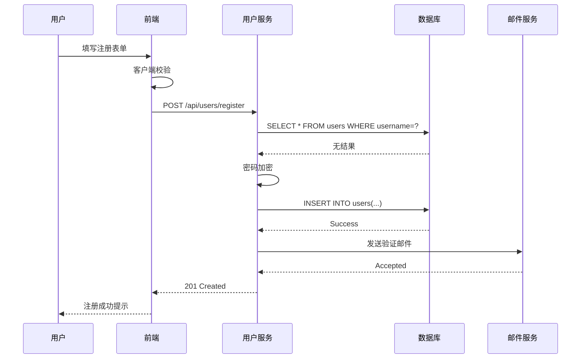
```mermaid
sequenceDiagram
    participant U as 用户
    participant F as 前端
    participant S as 用户服务
    participant DB as 数据库
    participant M as 邮件服务
    
    U->>F: 填写注册表单
    F->>F: 客户端校验
    F->>S: POST /api/users/register
    S->>DB: SELECT * FROM users WHERE username=?
    DB-->>S: 无结果
    S->>S: 密码加密
    S->>DB: INSERT INTO users(...)
    DB-->>S: Success
    S->>M: 发送验证邮件
    M-->>S: Accepted
    S-->>F: 201 Created
    F-->>U: 注册成功提示
```

#### 代码片段
```typescript
// React 注册组件示例
import React, { useState } from 'react';

interface FormData {
  username: string;
  email: string;
  password: string;
}

export const RegisterForm: React.FC = () => {
  const [formData, setFormData] = useState<FormData>({
    username: '',
    email: '',
    password: ''
  });

  const handleSubmit = async (e: React.FormEvent) => {
    e.preventDefault();
    try {
      const response = await fetch('/api/users/register', {
        method: 'POST',
        headers: { 'Content-Type': 'application/json' },
        body: JSON.stringify(formData)
      });
      
      if (response.ok) {
        alert('注册成功！请查收验证邮件。');
      }
    } catch (error) {
      console.error('注册失败:', error);
    }
  };

  return (
    <form onSubmit={handleSubmit}>
      {/* 表单字段 */}
    </form>
  );
};
```

#### 总结
| 模块 | 职责 | 技术选型 |
|------|------|----------|
| 前端 | 用户交互、表单校验 | React + TS |
| 网关 | 路由、限流、鉴权 | Spring Cloud Gateway |
| 服务 | 业务逻辑处理 | Spring Boot |
| 数据 | 持久化存储 | PostgreSQL |
| 通知 | 邮件发送 | SMTP / SendGrid |

---

## 六、特殊字符与边界情况测试

### 6.1 表格中的特殊内容
| 场景 | 内容 |
|------|------|
| 代码 | `git commit -m "test"` |
| 链接 | https://github.com |
| 图片 | !https://dl.svgcdn.com/svg/simple-icons/mermaid.svg |
| 公式 | $a^2 + b^2 = c^2$ |
| 粗体+斜体 | ***混合样式*** |
| 空单元格 |  |
| 长文本 | 这是一段非常长的文本内容，用于测试表格单元格的自动换行功能是否正常工作 |

### 6.2 列表中的代码块
1. 第一步：安装依赖
   ```bash
   npm install
   ```
2. 第二步：运行项目
   ```bash
   npm start
   ```
3. 第三步：验证
   - 打开浏览器访问 `http://localhost:3000`
   - 查看控制台输出

### 6.3 引用中的 Mermaid
> 以下是简单的流程图：
> 
> ```mermaid
> flowchart LR
>     A --> B
>     B --> C
> ```

---

## 七、结语

本文档涵盖了：
- ✅ Markdown 基础语法（标题、段落、列表、表格等）
- ✅ Markdown 扩展语法（数学公式、脚注、Emoji）
- ✅ Mermaid 基础图表（流程图、时序图、类图等）
- ✅ Mermaid 高级图表（甘特图、思维导图、用户旅程）
- ✅ C4 架构模型（Context、Container、Component、Dynamic、Deployment）

如果你的渲染器能够正确显示以上内容，说明它对 Markdown 和 Mermaid 的支持非常完善！

---

*Generated by AI Assistant | Test Document v2.1*

---